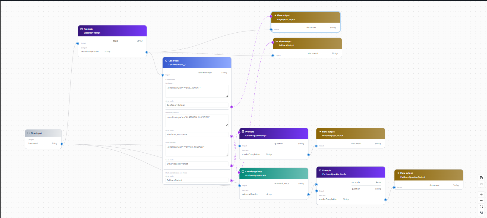
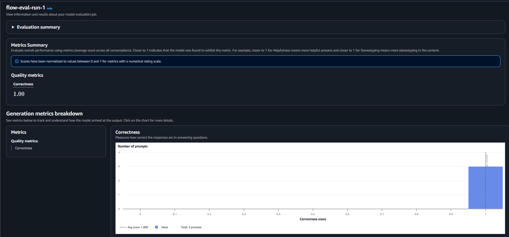

# Customer Support Chatbot with Amazon Bedrock Flows

An AI-routed customer support system built on **Amazon Bedrock Flows**. It classifies incoming customer messages and routes each to a dedicated response path, backed by a Bedrock Knowledge Base, a Bedrock Guardrail, and an LLM-as-judge evaluation suite.

**Result: 1.00 average correctness across 7 test cases** (Bedrock Evaluations, judge model: Amazon Nova Pro) — including edge cases like ambiguous messages, uncovered FAQ questions, and a prompt-injection attempt.



## How it works

A customer message is classified into one of three categories and routed accordingly:

| Category | Path |
|---|---|
| **Bug report** | Acknowledged by a dedicated prompt node that confirms a ticket and asks follow-up questions (repro steps, browser/OS/device) when details are missing |
| **Platform question** | Answered from a **Bedrock Knowledge Base** built from the FAQ document, with a fallback to a support phone number when the question isn't covered |
| **Other request** | Redirected to a support phone number |

All three paths sit behind a **Bedrock Guardrail** that filters harmful content. A Lambda tool (`lambda/create_bug_report.py`) that writes bug reports to DynamoDB was built and verified independently — see [Known limitation](#known-limitation-bedrock-agent--automatic-ticket-creation) for why it isn't fully wired into the live flow yet.

## Tech stack

Amazon Bedrock Flows · Bedrock Knowledge Bases · Bedrock Guardrails · Bedrock Evaluations (LLM-as-judge) · AWS Lambda · DynamoDB · CloudFormation · Python (boto3)

## Evaluation

Tested with an automated suite (`evaluation/flow-tests.json`, 7 cases covering all 3 paths plus edge cases) and scored with Bedrock Evaluations.

- **Final: 1.00 average correctness** across all 7 tests (`evaluation/eval-results-final.jsonl`)
- **Earlier run: 0.71** average correctness, before the bug-report path was fixed to return a real acknowledgment instead of a raw classifier label (`evaluation/eval-results.jsonl`)

Full write-up, including the guardrail tuning finding, is in [README_evaluation.md](./README_evaluation.md).



## Known limitation: Bedrock Agent / automatic ticket creation

The bug-report path was originally designed to use a **Bedrock Agent** to collect information conversationally and invoke the Lambda tool to create a ticket automatically. This couldn't be wired in because **Bedrock Agents Classic closed to new customers on July 30, 2026**, and this AWS account has no prior agent usage — `CreateAgent` returns `AccessDeniedException` (reproducible via CLI, confirmed on two separate AWS accounts).

- The Lambda tool itself works and was verified directly — see `evidence/response2.json` and `screenshots/06-dynamodb-bug-report-record.png` for a successfully created DynamoDB record.
- As a substitute, the flow uses a `BugReportPrompt` node that generates a realistic acknowledgment directly from the classifier's output. It doesn't call the Lambda tool as part of the live flow — that requires the Agent (or an equivalent mechanism) this account can't currently provision.
- Console evidence of the platform-level block: `screenshots/05-bug-report-agent-blocked.png`, `screenshots/agents-classic-maintenance-mode.png`.

## Notable engineering decisions

- **Guardrail tuning**: `customer-support-guardrail` filters sexual, violent, hateful, insulting, and misconduct content on every prompt node. Its `PROMPT_ATTACK` filter was tested and found to false-positive on every request — including benign ones — because Bedrock Flows submits the full rendered prompt (including the flow's own instruction-heavy system text) to the guardrail as one unit, and that phrasing reads as an attack pattern. It was disabled in favor of prompt-level injection resistance, verified by a dedicated test case (`t7_prompt_injection`) confirming the flow doesn't leak its system prompt or comply with injected instructions.
- **Knowledge Base over embedded FAQ**: the platform-question path retrieves from a Bedrock Knowledge Base (`data/online_shop_faq.md`) instead of embedding the full FAQ text in every prompt call.
- **Edge-case coverage**: the test suite includes an ambiguous message, a very short message, an uncovered FAQ question, and a prompt-injection attempt, beyond the three baseline path tests.
- Structured/JSON-schema-constrained output for the classifier was investigated but isn't currently supported by the Bedrock Flows Prompt node (confirmed against the `PromptFlowNodeConfiguration` API schema). Strict prompt instructions are used instead and verified reliable across all test runs.

## Repo structure

```
lambda/         Lambda tool for ticket creation (create_bug_report.py)
scripts/        Build/setup scripts used to assemble the flow, guardrail, and knowledge base
evaluation/      Test suite, eval configs, and Bedrock Evaluations output
infra/          CloudFormation templates and IAM policies
data/           Source FAQ document for the Knowledge Base
evidence/       Raw request/response captures from manual and scripted test runs
flow-history/    Flow/routing/guardrail definition exports at various build stages
screenshots/    Console evidence referenced throughout this README and README_evaluation.md
```

## Setup

```bash
pip install -r requirements.txt
```

Requires AWS credentials with Bedrock, Lambda, and DynamoDB permissions. See `infra/` for the CloudFormation stacks and IAM policies used to provision supporting resources.

Run the evaluation suite:

```bash
python evaluation/generate-eval-dataset.py \
  --tests-json evaluation/flow-tests.json \
  --flow-id VJD7SPYVVH \
  --flow-alias-id <alias-id> \
  --out-jsonl evaluation/output_eval_dataset.jsonl
```

## Detailed evaluation notes

See [README_evaluation.md](./README_evaluation.md) for the full evaluation write-up, including the guardrail false-positive finding and the Agents Classic limitation.
